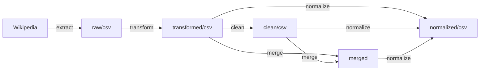
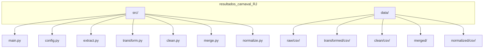

# RESCAR

O ResCar é um pipeline escrito em Python para extrair, transformar, limpar e normalizar resultados do Carnaval do RJ (Grupo Especial), a partir de 1996 até um ano limite definido pelo usuário, usando como fonte as tabelas disponíveis na Wikipedia e, por fim, gerando CSVs prontos para o load em um banco de dados SQL, que é o objetivo da aplicação no escopo desse projeto, ou qualquer outro uso.

Agradecimentos ao meu grande amigo [@pedmrs](https://github.com/pedmrs), que atenciosamente revisou o código e contribuiu com a documentação.

## Sobre as fontes de dados

A Wikipedia foi escolhida como fonte da extração por vários motivos, entre eles: 1) embora a LIESA (fonte primária por definição) disponibilize diversos resultados de carnavais passados em seu site (começando em 2006), as URLs não são padronizadas, variando muito ano a ano e dificultando um script efetivo sem muitas exceções e, além disso, boa parte das informações está em arquivos PDF como imagem, tornando praticamente impossível o tratamento prático em Python sem uma quantidade enorme de recursos, de forma que garanta a validade dos dados; 2) a Wikipedia disponibiliza resultados até anteriores do marco temporal escolhido para o projeto (início em 1996), tendo como fonte os dados divulgados pela própria LIESA através dos anos, e organizados de forma mais ou menos padronizada, possibilitando um ETL muito mais eficiente e preciso. O pipeline pensado nesse projeto pode ser reproduzido em qualquer computador, de qualquer lugar, com uma quantidade mínima de recursos.

## Análises

Na pasta de notebooks do JupyterLab são adicionados cadernos de análise com visualização de dados a partir de queries extraídas do banco SQL modelado para esse projeto. O objetivo é demonstrar uma parte do que pode ser feito a partir desse projeto. 

## Pipeline



- **extract**: acessa as páginas da Wikipedia, extrai tabelas de resultados e grava em `data/raw/csv/`.
- **transform**: converte tabelas wide em formato longo `escola`, `ano`, `quesito`, `jurado`, `nota` em `data/transformed/csv/`.
- **clean**: Remove linhas com dias da semana na coluna escola, normaliza `nota` para float (0–10) e grava em `data/clean/csv/`.
- **merge**: Concatena CSVs de uma pasta em um único arquivo em `data/merged/`.
- **normalize**: Aplica dicionário de sinônimos de escolas e grava em `data/normalized/csv/`.


## Estrutura



| Pasta / arquivo    | Descrição                                                   |
|--------------------|-------------------------------------------------------------|
| `src/main.py`      | CLI interativo: comando único por execução.                 |
| `src/config.py`    | Caminhos base (`data/`, raw, transformed, clean, merged).   |
| `src/extract.py`   | Extração Wikipedia -> `data/raw/csv/`.                      |
| `src/transform.py` | Transformação wide -> long -> `data/transformed/csv/`.      |
| `src/clean.py`     | Limpeza -> `data/clean/csv/`.                               |
| `src/merge.py`     | Merge de CSVs -> `data/merged/`.                            |
| `src/normalize.py` | Normalização de nomes de escolas -> `data/normalized/csv/`. |
| `data/`            | Diretório de dados do ETL                                   |
| `notebooks/`       | Diretório com notebooks do JupyterLab ensaiando análises    |
| `schema/`          | Diretório com o esquema do banco de dados SQL para load     |

## Uso

```bash
python src/main.py
```
No prompt, digite um comando: `extract`, `transform`, `clean`, `merge` ou `normalize`. Use `/exit` para sair.

Cada comando pede os inputs necessários (ex.: último ano da série para `extract`, diretório para `clean`/`merge`/`normalize`).


## Dependências

- Crie o ambiente virtual (.venv) na pasta do projeto:

    ```bash
  python -m venv .venv
  ```


- Ative o .venv:

    ```bash
    source .venv/bin/activate
    ```

- Instale as dependências a partir do arquivo de dependências do projeto:

    ```bash
    pip install -r requirements.txt
    ```
  
## Ferramentas

As ferramentas usadas no projeto até o momento, como um todo, incluem:
- Python 🐍 *(scripts, Pandas, Matplotlib, Seaborn, etc)*
- SQL 🗄️ *(Postgres)*
- JupyterLab 📔